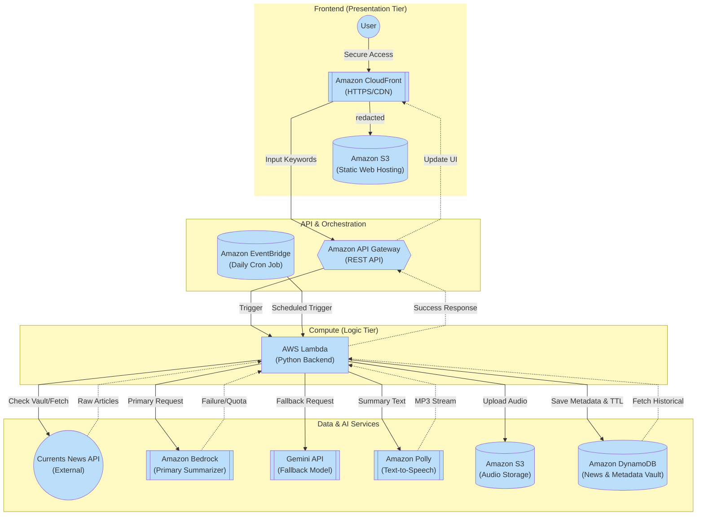

# EchoNewsAI
A news website providing latest headlines and audio summary for handsfree experience using 90% AWS services

# EchoNews AI: Serverless News Orchestration & Delivery Engine

> A high-availability, serverless news platform that summarizes global headlines into high-fidelity audio briefings.

## 🎓 Academic Implementation
This project was developed as a **Mini-Project for the Cloud Computing Laboratory (CCL)**. It demonstrates a practical application of event-driven, serverless architecture using industry-standard cloud patterns.

### 💰 Cost-Efficient Design (AWS Free Tier)
This system is architected to operate entirely within the **AWS Free Tier**:
* **AWS Lambda:** 1 Million free requests/month.
* **Amazon DynamoDB:** 25GB of free storage.
* **Amazon S3:** 5GB of standard storage.
* **Amazon Polly:** 5 million characters/month.
* **Gemini API:** Free tier utilized for summarization redundancy.

## System Architecture

## 🌟 Features
* **On-Demand News Synthesis:** Generates unique audio summaries based on specific user-provided keywords.
* **Community-Driven Activity Feed:** The "Trending Now" row reflects the latest 10 news summaries generated by the global user base, synced in near real-time via DynamoDB.
* **Hybrid AI Intelligence:** Primary summarization via **Amazon Bedrock (Claude/Titan)** with an automated fallback to the **Gemini API** to bypass quotas and ensure 100% uptime.
* **Scheduled Audio Briefings:** Automated cron-triggers via EventBridge for Morning, Afternoon, and Evening updates.
* **TTL-Managed History:** Automatic data cleanup using DynamoDB Time-to-Live (TTL) to manage storage costs.

---

## 🛠️ Implementation & Tech-Stack

| Service | Category | Role in Project |
| :--- | :--- | :--- |
| **Amazon S3** | Storage | Hosts the React frontend and stores `.mp3` assets. |
| **AWS Lambda** | Compute | Serverless "Engine" orchestrating API calls and DB updates. |
| **DynamoDB** | Database | Metadata "Vault" for news indexing and search history. |
| **API Gateway** | API | The "Bridge" between the web UI and backend logic. |
| **CloudFront** | CDN | Provides global HTTPS security and low-latency delivery. |
| **Polly** | AI/ML | High-fidelity Text-to-Speech (TTS) engine. |

## 🗺️ Development Roadmap

### Phase 1: Cloud-Dev Linkage
We established the core foundation by linking VS Code to the AWS Environment using the **AWS CLI**. We initialized the project structure using **AWS SAM** to manage our infrastructure as code.
More instruction about setting up aws cli and aws sam is provided in the Readme.md present in the backend/

### Phase 2: Ingestion & API Integration
We developed the news fetcher module using the **Currents News API**. We focused on creating a resilient backend within **Lambda** that could handle diverse search queries and filter raw article data.

### Phase 3: The Intelligence Pipeline
We built a redundant AI pipeline. We integrated **Amazon Bedrock** as the primary summarizer and configured the **Gemini API** as a fallback. We then implemented **Amazon Polly** to add the vocal layer to the text summaries.

### Phase 4: Persistence & Deployment
We transitioned from a temporary data flow to a persistent one. We used **DynamoDB** to index news metadata and **S3** for media storage. The entire stack was deployed live using `sam deploy`.

### Phase 5: Secure Frontend Delivery
We developed a responsive **React** UI to interact with our API. Finally, we deployed the frontend to **S3** and configured **Amazon CloudFront** to provide a secure **HTTPS** endpoint.

## 🎬 Demo
link to the website: https://echonews-web-2026.s3.us-east-1.amazonaws.com/index.html

## 📥 Installation
1. **Clone:** `git clone https://github.com/your-username/EchoNews-AI.git`
2. **Setup Backend:** 
   cd backend && sam build && sam deploy --guided
3. **Setup Frontend:** 
   cd frontend && npm install && npm run build &&
   aws s3 sync dist/ s3://your-bucket-name
